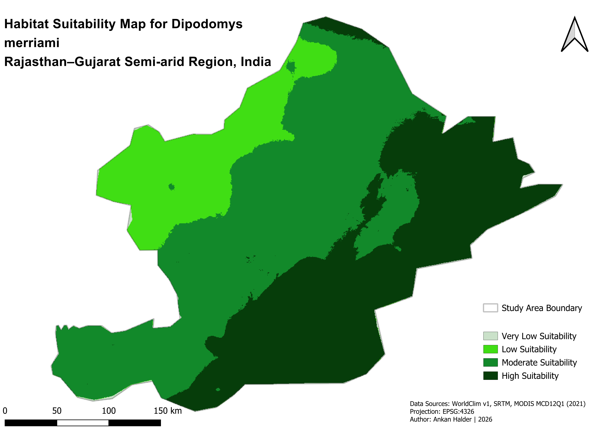

# Habitat Suitability Modelling — Hypothetical Arid-Adapted Species

---

## Project Overview
This repository presents a reproducible GIS-based habitat suitability modelling workflow integrating climatic, topographic, and land-cover predictors. The pipeline combines Google Earth Engine for environmental data acquisition with QGIS-based raster processing, suitability scoring, and weighted overlay modelling.

The project is designed as a methodological demonstration of an end-to-end spatial ecological modelling framework rather than a validated species distribution model.

---

## Scientific Objectives
- Develop a transparent geospatial modelling workflow
- Integrate heterogeneous environmental predictors
- Generate spatially explicit habitat suitability classifications
- Demonstrate reproducible ecological GIS methodology
- Provide a structured research-grade repository template

---

## Study Region
Semi-arid landscape spanning western Rajasthan and northern Gujarat, India.

**Coordinate System:** EPSG:4326 (WGS84)  
**Spatial Resolution:** ~1 km (inherited from WorldClim dataset)  

All predictor layers were clipped to a predefined region of interest polygon prior to analysis.

---

## Environmental Predictors

### Climate Variables (WorldClim)
- BIO1 — Annual Mean Temperature
- BIO12 — Annual Precipitation
- BIO15 — Precipitation Seasonality

### Terrain Variable
- SRTM Elevation

### Land Cover Variable
- MODIS MCD12Q1 (2021)

---

## Methodological Workflow
1. Region of interest defined in Google Earth Engine
2. Environmental rasters clipped to ROI
3. GeoTIFF export
4. Import into QGIS
5. Raster alignment and preprocessing
6. Ecological suitability reclassification
7. Weighted overlay modelling
8. Habitat suitability classification
9. Map layout generation and export

Detailed methodology available in `/paper/methods.md`

---

## Habitat Suitability Model

Weighted multi-criteria overlay:

```
HSI = (0.30 × BIO1)
    + (0.25 × BIO12)
    + (0.20 × LandCover)
    + (0.15 × Elevation)
    + (0.10 × BIO15)
```

Weights were assigned according to assumed ecological relevance for a hypothetical arid-adapted species.

---

## Final Suitability Map


---

## Repository Structure
```
data_raw/              original datasets
data_processed/        aligned and reclassified rasters
outputs/               final model outputs
documentations/        methodology
gee_scripts/           Earth Engine scripts
qgis_project/          QGIS project files
paper/                 manuscript-style documentation
validation/            robustness + uncertainty analysis
workflow/              pipeline description and diagram
maps/                  final suitability map
```

---

## Output Files

### Final suitability rasters:
- HabitatSuitability_raw.tif
- HabitatSuitability_norm.tif
- HabitatSuitability_classes.tif
- HabitatSuitability_classes_clipped.tif

### Individual predictor suitability layers:
- BIO1_suitability.tif
- BIO12_suitability.tif
- BIO15_suitability.tif
- Elevation_suitability.tif
- LandCover_suitability.tif

---

## Validation and Robustness
Model sensitivity, predictor relationships, and uncertainty considerations are documented in:

```
/validation/
```

These analyses evaluate stability of suitability predictions under weight variation and conceptual multicollinearity assessment.

---

## Reproducibility Status
- Fully reproducible workflow  
- Public datasets only  
- Version-controlled outputs  
- Transparent modelling steps  
- Structured scientific documentation  

---

## Software Environment
- Google Earth Engine — environmental data acquisition
- QGIS 3.34 — spatial processing and modelling
- R — raster inspection and verification

---

## Limitations
- No species occurrence data included
- Thresholds defined using expert-based assumptions
- No statistical validation performed
- Output represents environmental suitability, not confirmed species distribution

---

## Release Version
Stable release available here:

Habitat Suitability Model v1.0 — Reproducible GIS Workflow  
https://github.com/Ankanhalder2000/habitat-suitability-modelling-arid-species/releases/tag/v1.0

---

## Intended Use
This repository is intended for:

- demonstration of GIS modelling competence
- academic portfolio review
- methodological teaching
- research reproducibility demonstration
- technical skill assessment

---

## Author
Ankan Halder  

---

## License
MIT License
